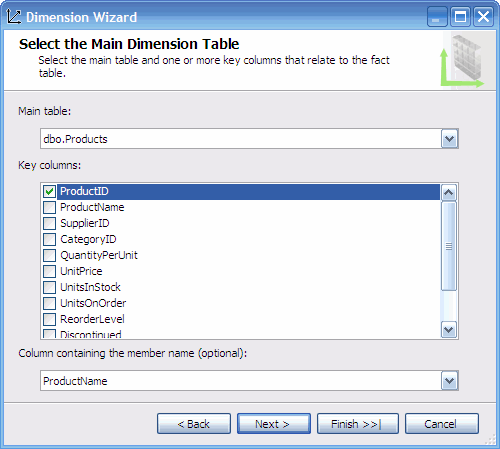
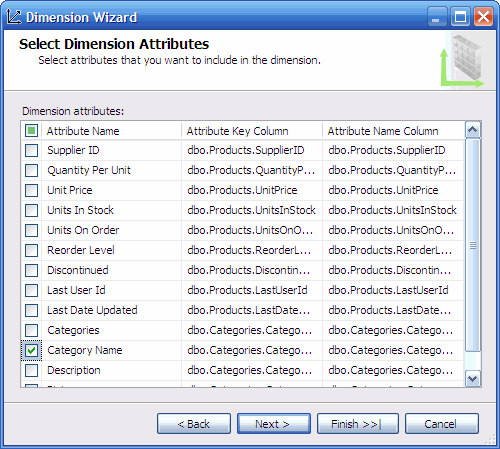
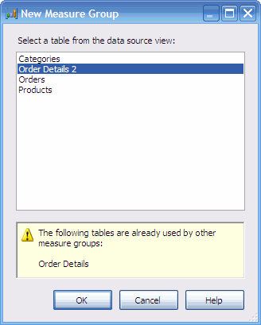

# Market Basket Analysis in SSAS 2005+

Originally posted here:
https://www.codeproject.com/Articles/33765/Market-Basket-Analysis-in-SSAS-2005

## Introduction

This article explains how to do Market Basket Analysis in SSAS 2005 (Microsoft SQL Analysis Services). Market Basket Analysis answers questions of this kind: 
"How many customers who bought product A also bought product B?" 
This article assumes some prior knowledge of SSAS and MDX. Here is what we want the result set to look like:

The following example will use the Northwind sample database. If you don’t have this database installed on your server, 
please use this file: Northwind.sql. The Northwind database has the following Entity Relationship Diagram:

To understand the problem, let us suppose we have a Sales cube with a Product dimension.

Initially, I thought the Market Basket Analysis would be easy to create by placing the Product dimension on both rows and columns. Here is the MDX:

`
SELECT 
    [Products].[Products].Members on Rows,
    [Products].[Products].Members on Columns
    FROM [Sales]
`

However, the statement above will return an error:

`
The Products hierarchy already appears in the Axis0 axis. 
`

The next apparent solution to this problem is to add a duplicate cube dimension (Products 2) to the Sales cube. Here is the MDX:

`
SELECT 
    [Products].[Products].Members on Rows,
    [Products 2].[Products].Members on Columns
    FROM [Sales]
`

However, this MDX returns the following result set:

You can see that the data is populated only diagonally. The problem is that you see that data only in intersection of Product A and Product A, 
or Product B and Product B. This is not what we want. This problem is caused by the way we linked two identical dimensions to the same measure group.

What we want is to see is Product A and Product B purchased together (have by the same order ID). This can be accomplished by doing the following:

1. Creating a duplicate measure group for the Sales data.
2. Linking two Sales measure groups by an Order dimension.
3. Linking first Sales measure groups to first Product dimension.
4. Linking second Sales measure groups to second Product dimension.
5. Hiding measures in the second measure group.
6. Linking second Product dimension to the first Sales measure group using a Many-to-Many relationship type.

So, let us begin by creating a project in BIDS (SQL Server Business Intelligence Development Studio).

Next, create a connection to the Nothwind database:

Next, create the data source view:

Next, create the Product dimension by using the Products and Categories tables. The key for the dimension will be ProductID.

Next, create the Orders dimension by using the Orders Table. The key for the dimension will be OrderID.

Now, create the Sales cube. Uncheck the Auto-Build.

To create a duplicate measure group, you will need to create a duplicate Sales table in the Data Source View. 
We have to do this because SSAS does no allow you to create two measure groups for one table. 
Open the Data Source View; right click on en empty area and choose Add New Named Query. The query should be:

`
SELECT * FROM [Order Details]
`

The Data Source View should look like:

Under the Cube structur, tab, right click on the cube and choose to add a new measure group.

Under the Dimension Usage tab, right click to add a new cube dimension. Choose Products. Rename the cube dimension to “Products 2”.

Link the second product dimension to the first Sales measure group using a Many-to-Many relationship type.

## Deployment
If you are too lazy to follow the steps above, you can restore the OLAP database from this backup file: Northwind.abf. 
Make sure to update the connection and password to the NorthWind database.

Alternatively, you can restore the OLAP database from the XMLA script file: Northwind.xmla. Make sure to update the connection 
and password to the Northwind database and to process the database.

## Points of interest
Next, you might want to try a multi-product analysis. This kind of analysis would answer questions 
like “How many customers who buy product A and B also buy product C?” As you might have guessed, the solution to this problem is the same. 
You will need to create a new Product cube Dimension and another duplicate of the Order Details measure group.
